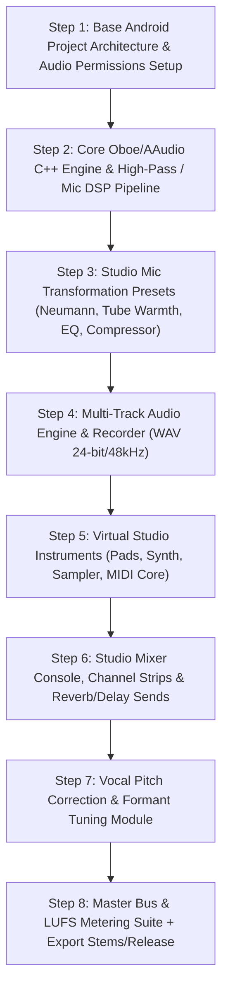

# StudioProd: Professional Studio & Music Production Suite for Android
## Architecture Blueprint & Feature Roadmap

---

## 1. Studio Microphone DSP Transformation Engine (Solving Telephone Sound)

Mobile microphones are standard MEMS capsules designed primarily for voice calls. They suffer from high-frequency roll-off, harsh midrange resonances, aggressive default noise gating, low dynamic headroom, and boxy proximity effect.

`StudioProd` converts raw mobile microphone input into warm, silky, high-headroom studio condenser / vintage tube mic audio using a custom 32-bit float NDK/C++ DSP pipeline:

```
[ MEMS Mobile Mic Input (16/24-bit 48kHz PCM) ]
                       │
                       ▼
 1. High-Pass Filter (HPF @ 80Hz - 100Hz 18dB/oct butterworth)
       (Removes mic handling noise, wind, & sub-bass rumble)
                       │
                       ▼
 2. Acoustic Impulse Response Calibration (Convolution Engine)
       (Transforms frequency profile to Neumann U87 / AKG C414 / Sony C800G)
                       │
                       ▼
 3. Spectral Noise Suppression & Ambient Cancellation
       (Subtracts room reflections and background fan/AC noise)
                       │
                       ▼
 4. Vocal De-Esser & Resonance Tamer (Dynamic Notch @ 4kHz-8kHz)
       (Squelches sibilance "sss/ttt" peaks)
                       │
                       ▼
 5. Tube Preamp Emulation & Warmth (Even Harmonic Saturation)
       (Adds 2nd/3rd order tube harmonics & analogue warmth)
                       │
                       ▼
 6. Multi-Band Studio Compressor (VCA / Optical Emulation)
       (Smooths dynamic range with fast attack & smooth release curve)
                       │
                       ▼
 7. Parametric Air EQ (High-Shelf Boost @ 12kHz - 16kHz + Air band)
       (Adds studio shimmer, presence, and vocal clarity)
                       │
                       ▼
 8. Spatial Vocal Ambience (Convolution Reverb / Plate Reverb)
       (Places dry mic capture in treated studio booth environment)
                       │
                       ▼
[ Studio-Grade Master Vocal Output Track (32-bit Float) ]
```

---

## 2. Feature Matrix: End-to-End Studio Workflow

### Phase A: Pre-Production & Session Setup
* **Project Engine**: Multi-BPM, signature change support, tap tempo, beat grids.
* **Metronome**: Sample-accurate acoustic/electronic click with customizable accents and visual flash.
* **Scale & Pitch Lock**: Key signature detector, scale quantization (Major, Minor, Pentatonic, Chromatic).

### Phase B: Recording & Tracking (Vocal & Instruments)
* **High-Performance Audio Tracking**: Low-latency AAudio / Oboe backend (<10ms roundtrip latency).
* **Studio Mic Processor**: Real-time microphone transformation (Vintage Tube, Modern Condenser, Ribbon, Dynamic Stage Mic presets).
* **Virtual Studio Instruments**:
  * **Sampler & Drum Pads**: Multi-velocity kit pads (Acoustic Studio Kit, 808 Trap, Vintage Funk, Percussion).
  * **Synthesizer Engine**: Subtractive/FM synth engine (Leads, Pads, Basses, Plucks).
  * **Virtual Piano & Keys**: Multi-sampled Grand Piano and Rhodes.
  * **External MIDI Support**: USB / Bluetooth LE MIDI keyboard & drum pad support.
* **Multi-Track Recording**: Unlimited audio tracks (vocals, acoustic instruments, electric guitar via amp simulator, virtual synths).
* **Monitoring & Punch-In**: Zero-latency headphone monitoring with reverb/delay FX send, Auto-Punch in/out recording.

### Phase C: Arranging & Audio Editing (DAW Suite)
* **Non-Destructive Audio Editor**: Clip trimming, slicing, crossfades, time-stretch (elastique-style), pitch-shift without tempo change.
* **Pitch Correction & Tuning Engine**: Real-time & offline Vocal Pitch Tuning (Natural correction to hard-tune Auto-Pitch effect).
* **Formant Shifter**: Gender/character shifting (Deep bass voice to bright pop vocal).
* **Take Folder & Comping**: Multi-take recording per track; seamlessly comp the best parts of each take into a master vocal.

### Phase D: Mixing Engine (Console View)
* **32-Bit Floating Point Audio Engine**: High headroom digital mixing console.
* **Channel Strip FX Per Track**:
  * 7-Band Interactive Parametric EQ (with real-time spectrum analyzer).
  * Studio Compressor / Limiter.
  * Noise Gate & Expander.
  * Pitch & Chorus Modulation.
* **Global Bus & Send FX**:
  * Lexicon-style Hall, Plate, and Studio Room Reverbs.
  * Stereo Ping-Pong / Tape Delay with Sync to BPM.
  * Guitar Amp Simulator (Clean, Crunch, Heavy Lead, Bass Amp).
* **Automation**: Real-time volume, pan, mute, and FX parameter automation curves.

### Phase E: Mastering & Final Release Studio
* **AI & Manual Mastering Suite**:
  * Target Loudness Metering (LUFS integration for Spotify -14 LUFS, Apple Music -16 LUFS, YouTube -14 LUFS).
  * Linear-Phase EQ for master bus polishing.
  * Multi-band Stereo Imaging & Widener.
  * Peak Limiter & Dither engine.
* **Export & Release Packaging**:
  * Uncompressed WAV (24-bit / 48kHz), FLAC, high-quality MP3/AAC export.
  * Individual Stems Export (Vocals Stem, Drums Stem, Bass Stem, Synths Stem) for mixing engineers.
  * Embedded ID3v2 metadata (Album Art, Artist Name, ISRC tag support).

---

## 3. Technology Stack & Architecture

| Layer | Component / Library | Purpose |
| :--- | :--- | :--- |
| **UI Framework** | Jetpack Compose + Material 3 (Dark Studio Theme) | Modern, responsive studio console interface |
| **Audio Core Engine** | C++ NDK + Google Oboe / AAudio | Ultra-low latency PCM recording & playback (<10ms) |
| **DSP Engine** | Custom C++ Audio DSP / Faust / Superpowered | High-pass filters, Convolution Reverb, Saturator, EQ |
| **Virtual Instruments** | SoundFont2 (SF2) / SFZ / Custom Synth Core | High fidelity instrument playback |
| **Visualizations** | Canvas / OpenGL ES | Real-time waveform rendering, FFT spectrum analyzer, VU meters |
| **Audio Storage** | Storage Access Framework + WAV/FLAC Encoders | High bit-depth audio recording & export |

---

## 4. Step-by-Step Execution Plan



### Immediate Step Roadmap:
1. **Initialize Android Project Base Structure**: Set up Android Gradle project in `studioprod` workspace with Kotlin, Jetpack Compose, audio permissions, and C++ NDK build bindings.
2. **Implement C++ DSP Mic Transformation Module**: Build the frequency-shaping and impulse response tube-emulation processor for phone mic inputs.
3. **Build Multi-Track Recorder UI & Engine**: Create intuitive track timeline, VU meters, wave visualizers, track volume/pan controls.
4. **Develop Studio Instruments & Sequencer**: Drum pad grid, piano roll editor, sound library.
5. **Integrate Mixing Console & Master Export**: Build parametric EQ UI, reverb sends, mastering loudness normalizer, and stem exporter.
